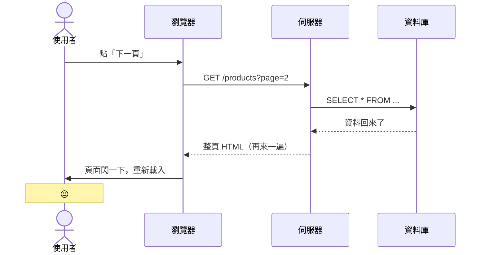

# 那段不堪回首的日子 🌑

<div
  v-motion
  :initial="{ x: -60, opacity: 0 }"
  :enter="{ x: 0, opacity: 1, transition: { duration: 600 } }"
  class="mt-4 text-xl opacity-60"
>
  在 Vue 存在之前，前端工程師過得怎麼樣...
</div>

<!--
先給大家一個心理準備：接下來的 code 可能會讓你感到不適。
但這都是真實發生過的事。
-->

---
level: 2
layout: two-cols
layoutClass: gap-10
---

# 每按一下都要跟伺服器說一聲

你熟悉這個流程：

<v-clicks>

- 使用者點「下一頁」→ 伺服器整頁重繪
- 使用者點「加入購物車」→ 伺服器整頁重繪
- 使用者打一個字 → ...（還好那時候還沒這麼做）
- 每次互動都是一次完整的 Request / Response

</v-clicks>

<div v-click class="mt-4 text-sm opacity-60 italic">
  說真的，這其實跟你們現在寫的 Razor Pages 一模一樣
</div>

::right::



<!--
這個架構沒什麼不好，只是使用者體驗不太好。
當時大家也都這樣，沒人覺得奇怪。
-->

---
level: 2
---

# jQuery：那時候覺得很潮 <carbon:campsite class="inline opacity-60" />

2006 年，John Resig 帶來了救世主：

````md magic-move {lines: true}
```js
// 當時覺得這樣就能統一瀏覽器，超帥的
$('#btn').click(function() {
  alert('Hello!')
})
```

```js
// 需求一多，就開始變這樣
$('#btn').click(function() {
  var name = $('#nameInput').val()
  if (name) {
    $('#greeting').text('你好，' + name + '！')
    $('#greeting').show()
  } else {
    $('#greeting').text('請輸入名字')
  }
})

$('#resetBtn').click(function() {
  $('#nameInput').val('')
  $('#greeting').text('')
  $('#greeting').hide()
})
```

```js {5-8|10-20|22-30}
// 真實專案長這樣（這段不是我寫的，但我維護過）
$(document).ready(function() {
  var cartItems = []
  var totalPrice = 0

  $('#addToCart').click(function() {
    var itemId   = $(this).data('id')
    var itemName = $(this).data('name')
    var itemPrice = parseFloat($(this).data('price'))

    cartItems.push({ id: itemId, name: itemName, price: itemPrice })
    totalPrice += itemPrice

    var $li = $('<li>').addClass('cart-item')
    $li.text(itemName + ' — NT$' + itemPrice)

    var $del = $('<button>').text('✕').click(function() {
      var idx = cartItems.findIndex(function(i) { return i.id === itemId })
      cartItems.splice(idx, 1)
      totalPrice -= itemPrice
      $('#totalPrice').text('NT$' + totalPrice.toFixed(0))
      $('#cartCount').text('(' + cartItems.length + ')')
      $li.remove()
    })

    $li.append($del)
    $('#cartList').append($li)
    $('#totalPrice').text('NT$' + totalPrice.toFixed(0))
    $('#cartCount').text('(' + cartItems.length + ')')
  })
})
```

```js
// 老實說，這些問題你我都懂...

// 💀 DOM 操作和資料狀態完全混在一起，誰是老大？
// 💀 同樣的 HTML 結構貼了三次（第四次忘記了）
// 💀 $('#那個東西') 找不到的時候靜默失敗，debug 到天荒地老
// 💀 改個需求：全部 $ 選擇器都要檢查一遍
// 💀 接手這段 code 的工程師：「這是什麼...」（然後辭職）
```
````

<!--
Magic move 展示 jQuery 從簡單到可怕的演進。
讓大家笑一下，因為這種 code 大概很多人看過。
-->

---
level: 2
---

# Ctrl+C Ctrl+V 大師的傑作 <carbon:copy class="inline opacity-60" />

「這三個卡片長得一樣，但我一定要寫三次」

<div class="grid grid-cols-3 gap-4 mt-4 text-xs font-mono">

<div v-click class="p-3 rounded border border-red-400/30 bg-red-400/5">

```html
<!-- 商品卡片 1 -->
<div class="card">
  
  <h3>商品名稱 A</h3>
  <p class="price">NT$ 299</p>
  <button onclick="addCart(1)">
    加入購物車
  </button>
</div>
```

</div>

<div v-click class="p-3 rounded border border-red-400/40 bg-red-400/8">

```html
<!-- 商品卡片 2 — 一模一樣！ -->
<div class="card">
  
  <h3>商品名稱 B</h3>
  <p class="price">NT$ 499</p>
  <button onclick="addCart(2)">
    加入購物車
  </button>
</div>
```

</div>

<div v-click class="p-3 rounded border border-red-400/50 bg-red-400/12">

```html
<!-- 商品卡片 3 — 還是！ -->
<div class="card">
  
  <h3>商品名稱 C</h3>
  <p class="price">NT$ 799</p>
  <button onclick="addCart(3)">
    加入購物車
  </button>
</div>
```

</div>

</div>

<div v-click class="mt-5 text-center text-base">
  產品說：「按鈕文字改成『立即購買』」
  <span v-mark.circle.red="4" class="ml-2 font-bold">你：😭 × 3</span>
</div>

<!--
讓大家笑一下。這種痛苦大家應該都感同身受。
不管是前端還是後端，重複 code 都是噩夢。
-->

---
level: 2
layout: two-cols
layoutClass: gap-12
---

# 等等，這個你早就會了

說真的，你早就在用元件化思維了，只是你不知道 😄

<div class="text-sm space-y-2 mt-4">

**痛苦的方式：**

```html
<div class="card">...</div>
<div class="card">...</div>  <!-- 複製 -->
<div class="card">...</div>  <!-- 再複製 -->
```

<div v-click class="mt-3">

**你熟悉的解法：**

```cshtml
@* _ProductCard.cshtml *@
@model ProductViewModel
<div class="card">
  <h3>@Model.Name</h3>
  <p>NT$ @Model.Price</p>
  <button>加入購物車</button>
</div>

@* 使用時 *@
@foreach (var p in Model.Products) {
    @Html.Partial("_ProductCard", p)
}
```

</div>
</div>

::right::

<div v-click class="mt-8">

**Vue 就是同一個概念的進化版：**

```vue
<!-- ProductCard.vue -->
<template>
  <div class="card">
    <h3>{{ name }}</h3>
    <p>NT$ {{ price }}</p>
    <button>加入購物車</button>
  </div>
</template>

<!-- 使用時 -->
<ProductCard
  v-for="p in products"
  :key="p.id"
  :name="p.name"
  :price="p.price"
/>
```

</div>

<div v-click class="mt-6 text-base text-center">
  Vue 元件 ≈ 加強版的
  <span v-mark.circle.green="4">Razor Partial</span>
  <carbon:arrow-right class="inline ml-1" />
</div>

<!--
這是整個 Part 1 最重要的一句話。

Vue 元件不是什麼神奇的新概念。
它就是你在用 Razor 做的事情，只是前端版本，而且更強大。

讓這個類比深入人心，後面介紹 Vue 會輕鬆很多。
-->
