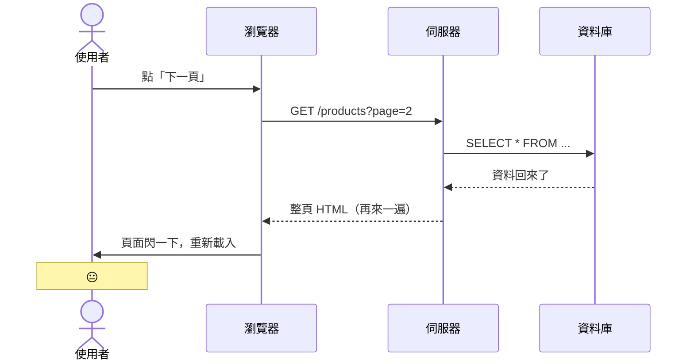

# 那段不堪回首的日子 🌑

<div
  v-motion
  :initial="{ x: -60, opacity: 0 }"
  :enter="{ x: 0, opacity: 1, transition: { duration: 600 } }"
  class="mt-4 text-xl opacity-60"
>
  在 SPA 出現之前，前端該怎麼做...
</div>

<!--
先給大家一個心理準備：接下來的 code 可能會讓你感到不適。
但這都是真實發生過的事。
-->

---
level: 3
layout: two-cols
layoutClass: gap-10
---

# 每個動作都要跟伺服器說一聲


<div v-motion :initial="{opacity:0,y:20}" :enter="{opacity:1,y:0,transition:{duration:500}}" class="text-violet-300">

- 使用者點「下一頁」→ 伺服器整頁重繪
- 使用者點「加入購物車」→ 伺服器整頁重繪
- 使用者打一個字 → ...（還好那時候還沒這麼做）
- 每次互動都是一次完整的 Request / Response

</div>

<div v-motion :initial="{opacity:0,y:20}" :enter="{opacity:1,y:0,transition:{delay:300,duration:400}}" class="mt-4 text-sm opacity-60 italic">
  Actually，這其實跟現在寫的 Razor Pages 一模一樣
</div>

::right::

<div v-motion :initial="{opacity:0,y:-100}" :enter="{opacity:1,y:0,transition:{delay:300,duration:400}}" class="mt-4 text-sm opacity-60 italic" v-click>



</div>

<!--
這個架構沒什麼不好，只是使用者體驗不太好。
當時大家也都這樣，沒人覺得奇怪。
-->

---
level: 2
---

# jQuery：曾經的潮流 <carbon-campsite class="inline opacity-60" />

2006 年，John Resig 帶來了救世主：

````md magic-move {lines: true}
```js
// 當時覺得這樣就能統一瀏覽器，超帥的
$('#btn').click(function() {
  alert('Hello!')
})
```

```js
// But 需求一多，就開始變這樣
$('#btn').click(function() {
  var name = $('#nameInput').val()
  if (name) {
    $('#greeting').text('你好，' + name + '！')
    $('#greeting').show()
  } else {
    $('#greeting').text('請輸入名字')
  }
})

$('#resetBtn').click(function() {
  $('#nameInput').val('')
  $('#greeting').text('')
  $('#greeting').hide()
})
```

```js {*|5-8|10-20|22-30}{maxHeight:'390px'}
// 真實專案應該是長這樣
$(document).ready(function() {
  var cartItems = []
  var totalPrice = 0

  $('#addToCart').click(function() {
    var itemId   = $(this).data('id')
    var itemName = $(this).data('name')
    var itemPrice = parseFloat($(this).data('price'))

    cartItems.push({ id: itemId, name: itemName, price: itemPrice })
    totalPrice += itemPrice

    var $li = $('<li>').addClass('cart-item')
    $li.text(itemName + ' — NT$' + itemPrice)

    var $del = $('<button>').text('✕').click(function() {
      var idx = cartItems.findIndex(function(i) { return i.id === itemId })
      cartItems.splice(idx, 1)
      totalPrice -= itemPrice
      $('#totalPrice').text('NT$' + totalPrice.toFixed(0))
      $('#cartCount').text('(' + cartItems.length + ')')
      $li.remove()
    })

    $li.append($del)
    $('#cartList').append($li)
    $('#totalPrice').text('NT$' + totalPrice.toFixed(0))
    $('#cartCount').text('(' + cartItems.length + ')')
  })
})
```

```js
// 這些問題我相信大家都懂...

// 💀 DOM 操作和資料狀態完全混在一起，誰是老大，以誰為主？
// 💀 同樣的 HTML 結構貼了三次（第四次忘記了）
// 💀 $('#那個東西') 找不到的時候靜默失敗，debug 到天荒地老
// 💀 改個需求：全部 $ 選擇器都要檢查一遍
// 💀 接手這段 code 的工程師：「這是什麼...」（然後爆炸）
```
````

<!--
Magic move 展示 jQuery 從簡單到可怕的演進。
讓大家笑一下，因為這種 code 大概很多人看過。
-->

---
level: 2
layout: two-cols
layoutClass: gap-10
---

# 每次都要重新造輪子 <carbon-recycle class="inline opacity-60" />

原生 / jQuery 時代：響應式 API 要自己從頭組裝

<div v-motion :initial="{opacity:0,y:20}" :enter="{opacity:1,y:0,transition:{duration:500}}" class="text-sm space-y-2 mt-4">

```js
// 庫存歸零，手動更新所有相關 DOM
function updateStock(val) {
  $('#count').text(val)
  $('#badge').text(val)
  $('#buyBtn').prop('disabled', val === 0)
  $('#label').toggleClass('text-red-500', val === 0)
  // 忘記第五個地方？→  靜默 BUG
}
// 每個有互動的頁面，都要從零搭這套「同步機制」
```

</div>

::right::

<div v-motion :initial="{opacity:0,y:20}" :enter="{opacity:1,y:0,transition:{delay:200,duration:500}}" class="mt-6 text-sm space-y-2" v-click="1">

**框架把這整套輪子都包好了：**

```vue
<template>
  <span>{{ stock }}</span>
  <span>{{ stock }}</span>
  <button :disabled="stock === 0">購買</button>
  <span :class="{ 'text-red-500': stock === 0 }">
    {{ stock > 0 ? '有貨' : '已售完' }}
  </span>
</template>
<!-- stock 一變，所有地方自動更新 ✅ -->
```

</div>

<div v-motion :initial="{opacity:0}" :enter="{opacity:1,transition:{delay:500,duration:400}}" class="mt-4 p-3 rounded bg-amber-400/10 border border-amber-400/30 text-sm text-amber-200" v-click="2">
  響應式系統、事件綁定、狀態同步 —<br>
  框架幫你造好輪子，你只需要管資料本身
</div>

<!--
從命令式（告訴 DOM 該做什麼）到宣告式（描述資料長什麼樣）。
這是框架最核心的價值主張。Part 4 響應式系統會深入展開。
-->

---
level: 2
---

# Ctrl+C, Ctrl+V 大師的傑作 <carbon-copy class="inline opacity-60" />

「這三個卡片長得一樣，但我一定要寫三次」

<div class="grid grid-cols-3 gap-4 mt-4 text-xs font-mono">

<div v-motion :initial="{opacity:0,y:20}" :enter="{opacity:1,y:0,transition:{duration:400}}" class="p-3 rounded border border-red-400/30 bg-red-400/5">

```html
<!-- 商品卡片 1 -->
<div class="card">
  
  <h3>商品名稱 A</h3>
  <p class="price">NT$ 299</p>
  <button onclick="addCart(1)">
    加入購物車
  </button>
</div>
```

</div>

<div v-motion :initial="{opacity:0,y:20}" :enter="{opacity:1,y:0,transition:{delay:150,duration:400}}" class="p-3 rounded border border-red-400/40 bg-red-400/8">

```html
<!-- 商品卡片 2 — 一模一樣！ -->
<div class="card">
  
  <h3>商品名稱 B</h3>
  <p class="price">NT$ 499</p>
  <button onclick="addCart(2)">
    加入購物車
  </button>
</div>
```

</div>

<div v-motion :initial="{opacity:0,y:20}" :enter="{opacity:1,y:0,transition:{delay:300,duration:400}}" class="p-3 rounded border border-red-400/50 bg-red-400/12">

```html
<!-- 商品卡片 3 — 還是！ -->
<div class="card">
  
  <h3>商品名稱 C</h3>
  <p class="price">NT$ 799</p>
  <button onclick="addCart(3)">
    加入購物車
  </button>
</div>
```

</div>

</div>

<div v-motion :initial="{opacity:0,y:20}" :enter="{opacity:1,y:0,transition:{delay:450,duration:400}}" class="mt-5 text-center text-base">
  PM說：「按鈕文字改成『立即購買』」
  <p class="ml-2 font-bold">你：😭 × 3</p>
</div>

<!--
讓大家笑一下。這種痛苦大家應該都感同身受。
不管是前端還是後端，重複 code 都是噩夢。
-->

---
level: 2
layout: two-cols
layoutClass: gap-12
---


# 元件化思維

等等，這個你早就會了，只是你不知道

<div class="text-sm space-y-2 mt-4">

**痛苦的方式：**

```html
<div class="card">...</div>
<div class="card">...</div>  <!-- 複製 -->
<div class="card">...</div>  <!-- 再複製 -->
```

<div v-motion :initial="{opacity:0,y:20}" :enter="{opacity:1,y:0,transition:{duration:400}}" class="mt-3">

**熟悉的解法：**

```html
@* _ProductCard.cshtml *@
@model ProductViewModel
<div class="card">
  <h3>@Model.Name</h3>
  <p>NT$ @Model.Price</p>
  <button>加入購物車</button>
</div>

@* 使用時 *@
@foreach (var p in Model.Products) {
    @Html.Partial("_ProductCard", p)
}
```

</div>
</div>

::right::

<div v-motion :initial="{opacity:0,x:100}" :enter="{opacity:1,x:0,transition:{delay:150,duration:400}}" class="mt-8" v-click>

**最先出現的三大SPA框架就是同一個概念的進化版：**

```vue
<!-- ProductCard.vue -->
<template>
  <div class="card">
    <h3>{{ name }}</h3>
    <p>NT$ {{ price }}</p>
    <button>加入購物車</button>
  </div>
</template>

<!-- 使用時 -->
<ProductCard
  v-for="p in products"
  :key="p.id"
  :name="p.name"
  :price="p.price"
/>
```

</div>

<div v-motion :initial="{opacity:0,y:-100}" :enter="{opacity:1,y:0,transition:{delay:300,duration:400}}" class="mt-6 text-base text-center" v-click="2">
  Vue 元件 ≈ 加強版的
  <span v-mark.circle.green="3">Razor Partial</span>
  <carbon:arrow-right class="inline ml-1" />
</div>

<div v-motion :initial="{opacity:0,y:20}" :enter="{opacity:1,y:0,transition:{delay:300,duration:400}}" class="mt-1 text-base text-center text-amber-300 underline" v-click="3">
 簡單來說，把元件當作一個可以重複執行的 function，隨時可重複呼叫，並且輸出固定
</div>

<!--
這是整個 Part 1 最重要的一句話。

Vue 元件不是什麼神奇的新概念。
它就是你在用 Razor 做的事情，只是前端版本，而且更強大。

讓這個類比深入人心，後面介紹 Vue 會輕鬆很多。
-->

---
level: 2
---

# 前端為什麼一直有新框架？ <carbon-renew class="inline opacity-60" />

<div v-motion :initial="{opacity:0,y:10}" :enter="{opacity:1,y:0,transition:{duration:400}}" class="mt-2 text-base opacity-70 italic">
  「求別再更新了，老子學不動了」— 經典名言
</div>

<div class="mt-5 grid grid-cols-5 gap-2 text-xs">

<div v-click="1" v-motion :initial="{opacity:0,y:20}" :enter="{opacity:1,y:0,transition:{duration:350}}" class="p-3 rounded border border-amber-400/30 bg-amber-400/5">
  <div class="text-amber-300 font-bold mb-2">2006 — <code>jQuery</code></div>
  ✅ 解決跨瀏覽器差異<br>
  <span class="opacity-50">❌ DOM 與狀態混在一起</span>
</div>

<div v-click="2" v-motion :initial="{opacity:0,y:20}" :enter="{opacity:1,y:0,transition:{duration:350}}" class="p-3 rounded border border-blue-400/30 bg-blue-400/5">
  <div class="text-blue-300 font-bold mb-2">2010 — <code>Backbone</code> / <code>Angular</code></div>
  ✅ MVC、雙向綁定<br>
  <span class="opacity-50">❌ 太重、曲線太陡、心智負擔重</span>
</div>

<div v-click="3" v-motion :initial="{opacity:0,y:20}" :enter="{opacity:1,y:0,transition:{duration:350}}" class="p-3 rounded border border-green-400/30 bg-green-400/5">
  <div class="text-green-300 font-bold mb-2">2013 — <code>React</code> / <code>Vue</code> / <code>Angular 2</code></div>
  ✅ 元件化、響應式<br>
  <span class="opacity-50">❌ SPA 的 SEO 問題，資料呈現速度問題開始浮現</span>
</div>

<div v-click="4" v-motion :initial="{opacity:0,y:20}" :enter="{opacity:1,y:0,transition:{duration:350}}" class="p-3 rounded border border-purple-400/30 bg-purple-400/5">
  <div class="text-purple-300 font-bold mb-2">2016+ — Meta Framework</div>
  <code>Next.js</code> · <code>Nuxt</code> · <code>Remix</code><br>
  ✅ SSR / SSG / ISR / PPR 都給你<br>
  <span class="opacity-50">❌ 複雜度繼續上升</span>
</div>

<div v-click="5" v-motion :initial="{opacity:0,y:20}" :enter="{opacity:1,y:0,transition:{duration:350}}" class="p-3 rounded border border-red-400/40 bg-red-400/8">
  <div class="text-red-300 font-bold mb-2">2020+ — 混搭時代 🌀</div>
  <code>Svelte</code> · <code>SvelteKit</code><br>
  <code>Astro</code> · <code>SolidJS</code> · <code>Qwik</code><br>
  <code>TanStack</code> · <code>Vike</code> · ...<br>
  <span class="opacity-50">❓ 選哪個?要學嗎？頭好暈</span>
</div>

</div>

<div v-click="6" v-motion :initial="{opacity:0,y:20}" :enter="{opacity:1,y:0,transition:{duration:400}}" class="mt-5 p-3 rounded bg-teal-400/10 border border-teal-400/30 text-sm text-teal-200">
  好消息：<strong>核心概念沒有變</strong> — 元件、響應式、<span v-mark.amber="7">狀態管理</span>、<span v-mark.amber="7">資料驅動畫面(Data-driven)</span><br>
  理解這些之後，下一個「新技術」對你來說只是換個語法而已
</div>

<!--
這一頁是給後端工程師最大的安慰。
不需要追每個新框架，理解概念比記 API 重要得多。
切換框架的成本遠比想像中低——就像你從 .NET Framework 遷移到 .NET Core 一樣。
-->
