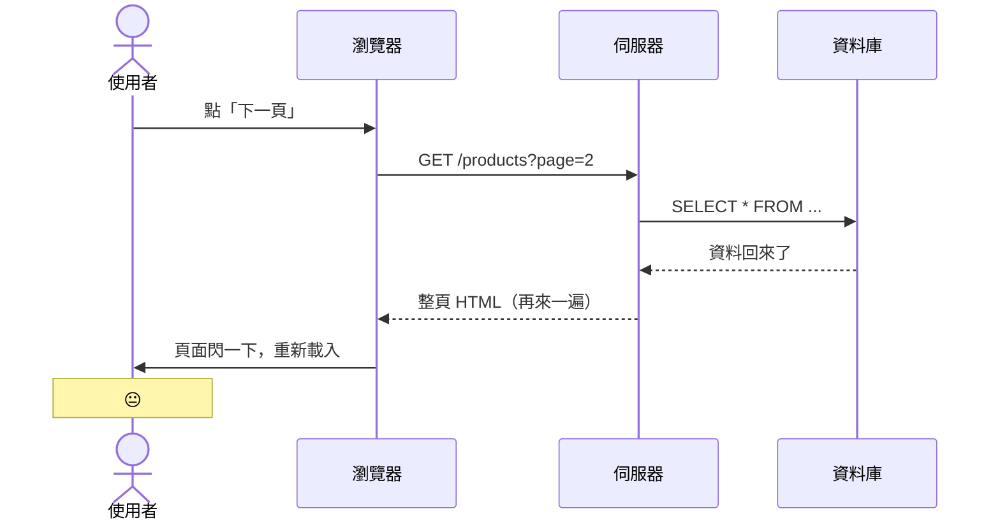

# 那段不堪回首的日子 🌑

<div
  v-motion
  :initial="{ x: -60, opacity: 0 }"
  :enter="{ x: 0, opacity: 1, transition: { duration: 600 } }"
  class="mt-4 text-xl opacity-60"
>
  在所謂的前端框架出現之前，前端該怎麼做...
</div>

<!--
先給大家一個心理準備：接下來的 code 可能會讓你感到不適。
但這都是真實發生過的事。
-->

---
layout: two-cols-header
layoutClass: list-flow-cols
level: 2
---

# 每個動作都要跟伺服器說一聲

::left::

<div v-motion :initial="{opacity:0,y:20}" :enter="{opacity:1,y:0,transition:{duration:500}}" class="text-violet-300 text-sm ">

- 使用者點「下一頁」→ 伺服器整頁重繪
- 使用者點「加入購物車」→ 伺服器整頁重繪
- 使用者打一個字 → ...（還好那時候還沒這麼做）
- 每次互動都是一次完整的 Request / Response

</div>

::right::

<div v-motion :initial="{opacity:0,y:-100}" :enter="{opacity:1,y:0,transition:{delay:300,duration:400}}" class="text-sm opacity-60 italic" v-click>



</div>

::bottom::

<div v-motion :initial="{opacity:0,y:16}" :enter="{opacity:1,y:0,transition:{delay:300,duration:400}}" class="mt-4 rounded border border-sky-400/30 bg-sky-400/10 px-4 py-3 text-sm text-sky-100 shadow-sm shadow-sky-900/20" v-click="2">
  <div class="mb-1 flex items-center gap-2 font-bold text-sky-300">
    <carbon:information class="text-base" />
    對照：Razor Pages
  </div>
  <div class="leading-relaxed opacity-85">
    Razor Pages 多半就是這種模式：每次操作回到伺服器產生一整頁 HTML。這類架構通常稱為
    <strong class="text-white">MPA</strong>
    <span class="opacity-70">（Multiple Page Application）</span>。
  </div>
</div>

<!--
這個架構沒什麼不好，只是使用者體驗不太好。
當時大家也都這樣，沒人覺得奇怪。

📌 可能有人會問：「那現在 Razor Pages 是 legacy 了嗎？」
→ 不是！MPA 對 SEO、內容型網站、後台系統仍然是好選擇。
架構沒有好壞，只有適不適合場景。

📌 「前後端分離」的副作用：每次互動都多一次 Round Trip，
加上頁面完整重繪，Flash（白屏閃爍）是當時最常被抱怨的問題。
-->

---
level: 2
---

# jQuery：曾經的潮流 <carbon-campsite class="inline opacity-60" />

2006 年，John Resig 帶來了救世主：

<div class="jquery-chaos-code">

````md magic-move [app.js ~i-logos:javascript~]{lines: true}{maxHeight:'250px'}
```js
// 當時覺得這樣就能統一瀏覽器，超帥的
$('#btn').click(function() {
  alert('Hello!')
})
```

```js
// But 需求一多，就開始變這樣
$('#btn').click(function() {
  var name = $('#nameInput').val()
  if (name) {
    $('#greeting').text('你好，' + name + '！')
    $('#greeting').show()
  } else {
    $('#greeting').text('請輸入名字')
  }
})

$('#resetBtn').click(function() {
  $('#nameInput').val('')
  $('#greeting').text('')
  $('#greeting').hide()
})
```

```js {*|5-8|10-20|22-30}
// 真實專案應該是長這樣
$(document).ready(function() {
  var cartItems = []
  var totalPrice = 0

  $('#addToCart').click(function() {
    var itemId   = $(this).data('id')
    var itemName = $(this).data('name')
    var itemPrice = parseFloat($(this).data('price'))

    cartItems.push({ id: itemId, name: itemName, price: itemPrice })
    totalPrice += itemPrice

    var $li = $('<li>').addClass('cart-item')
    $li.text(itemName + ' — NT$' + itemPrice)

    var $del = $('<button>').text('✕').click(function() {
      var idx = cartItems.findIndex(function(i) { return i.id === itemId })
      cartItems.splice(idx, 1)
      totalPrice -= itemPrice
      $('#totalPrice').text('NT$' + totalPrice.toFixed(0))
      $('#cartCount').text('(' + cartItems.length + ')')
      $li.remove()
    })

    $li.append($del)
    $('#cartList').append($li)
    $('#totalPrice').text('NT$' + totalPrice.toFixed(0))
    $('#cartCount').text('(' + cartItems.length + ')')
  })
})
```

```js
// 這些問題我相信大家都懂...

// 💀 DOM 操作和資料狀態完全混在一起，誰是老大，以誰為主？
// 💀 同樣的 HTML 結構貼了三次（第四次忘記了）
// 💀 $('#那個東西') 找不到的時候靜默失敗，debug 到天荒地老
// 💀 改個需求：全部 $ 選擇器都要檢查一遍
// 💀 接手這段 code 的工程師：「這是什麼...」（然後爆炸）
```
````

</div>

<!--
Magic move 展示 jQuery 從簡單到可怕的演進。
讓大家笑一下，因為這種 code 大概很多人看過。

[第1步] 這很簡潔，jQuery 解決了跨瀏覽器相容性，是個好工具。
[第2步] 需求開始增加，邏輯開始膨脹，但還算可讀。
[第3步] 點亮高亮區塊，問大家：「有沒有看到問題在哪？」
  → DOM 選擇器散落各處（#cartList、#totalPrice、#cartCount）
  → 資料（cartItems array）和畫面更新完全混在同一個 function 裡
  → 「加了一個商品」這件事，要手動通知 5 個不同的 DOM 節點
[第4步] 念出痛點，讓大家有共鳴。尤其是最後一條：接手這段 code 的工程師。

💡 核心問題不是 jQuery 語法，是「命令式思維的副作用」。
下一張投影片會正式說明命令式 vs 宣告式的差異。
-->

---
level: 2
layout: two-cols
layoutClass: gap-10
---

# 每次都要重新造輪子 <carbon-recycle class="inline opacity-60" />

原生 / jQuery 時代：響應式 API 要自己從頭組裝

<div v-motion :initial="{opacity:0,y:20}" :enter="{opacity:1,y:0,transition:{duration:500}}" class="text-sm space-y-2 mt-4">

```js [shopping.js ~i-logos:javascript~]
// 庫存歸零，手動更新所有相關 DOM
function updateStock(val) {
  $('#count').text(val)
  $('#badge').text(val)
  $('#buyBtn').prop('disabled', val === 0)
  $('#label').toggleClass('text-red-500', val === 0)
  // 忘記第五個地方？→  靜默無錯誤，完全無從得知
}
// 每個有互動的頁面，都要從零搭這套「同步機制」
```

</div>

<div v-motion :initial="{opacity:0}" :enter="{opacity:1,transition:{delay:500,duration:400}}" class="absolute bottom-16 left-14 right-14 p-3 rounded bg-amber-400/10 border border-l-3 border-amber-400/30 text-sm text-amber-200 text-center" v-click="2">
  響應式系統、事件綁定、狀態同步 —<br>
  框架幫你造好輪子，你只需要管資料本身
</div>

::right::

<div v-motion :initial="{opacity:0,y:20}" :enter="{opacity:1,y:0,transition:{delay:200,duration:500}}" class="mt-6 text-sm space-y-2" v-click="1">

**框架把這整套輪子都包好了：**

```vue [shopping.vue  ~i-logos:vue~]
<template>
  <span>{{ stock }}</span>
  <span>{{ stock }}</span>
  <button :disabled="stock === 0">購買</button>
  <span :class="{ 'text-red-500': stock === 0 }">
    {{ stock > 0 ? '有貨' : '已售完' }}
  </span>
</template>
<!-- stock 一變，所有地方自動更新 ✅ -->
```

</div>

<!--
從命令式（告訴 DOM 該做什麼）到宣告式（描述資料長什麼樣）。
這是框架最核心的價值主張。Part 4 響應式系統會深入展開。

📌 說明左欄：每次庫存改動，都要手動找到並更新所有相關的 DOM 節點。
  → 最怕的是漏掉某一個：沒有 compile error、沒有 runtime error，只是畫面說謊。

[click] 指著右欄說：「Vue 的做法是：stock 改了，Vue 自動找到所有用到它的地方更新。」
  → 你只管「資料是多少」，不管「誰在顯示這份資料」。

📌 類比給後端聽：
  命令式 = 每次有資料變動，手動呼叫所有相關的 Service / Repository 通知它們。
  宣告式 = 用 Observer pattern / Event-driven，資料改就廣播出去，訂閱者自己更新。
-->

---
level: 2
---

# Ctrl+C, Ctrl+V 大師的傑作 <carbon-copy class="inline opacity-60" />

「這三個卡片長得一樣，但我一定要寫三次」

<div class="grid grid-cols-3 gap-4 mt-4 text-xs font-mono">

<div v-motion :initial="{opacity:0,y:20}" :enter="{opacity:1,y:0,transition:{duration:400}}" class="p-3 rounded border border-red-400/30 bg-red-400/5">

```html
<!-- 商品卡片 1 -->
<div class="card">
  
  <h3>商品名稱 A</h3>
  <p class="price">NT$ 299</p>
  <button onclick="addCart(1)">
    加入購物車
  </button>
</div>
```

</div>

<div v-motion :initial="{opacity:0,y:20}" :enter="{opacity:1,y:0,transition:{delay:150,duration:400}}" class="p-3 rounded border border-red-400/40 bg-red-400/8" v-click="1">

```html
<!-- 商品卡片 2 — 一模一樣！ -->
<div class="card">
  
  <h3>商品名稱 B</h3>
  <p class="price">NT$ 499</p>
  <button onclick="addCart(2)">
    加入購物車
  </button>
</div>
```

</div>

<div v-motion :initial="{opacity:0,y:20}" :enter="{opacity:1,y:0,transition:{delay:300,duration:400}}" class="p-3 rounded border border-red-400/50 bg-red-400/12" v-click="1">

```html
<!-- 商品卡片 3 — 還是！ -->
<div class="card">
  
  <h3>商品名稱 C</h3>
  <p class="price">NT$ 799</p>
  <button onclick="addCart(3)">
    加入購物車
  </button>
</div>
```

</div>

</div>

<div v-motion :initial="{opacity:0,y:20}" :enter="{opacity:1,y:0,transition:{delay:450,duration:400}}" class="mt-5 text-center text-base" v-click="2">
  PM說：「按鈕文字改成『立即購買』」
  <p class="ml-2 font-bold">你：😭 × 3</p>
</div>

<!--
讓大家笑一下。這種痛苦大家應該都感同身受。
不管是前端還是後端，重複 code 都是噩夢。
-->

---
level: 2
---


# 元件化思維：後端其實早就在做

同一個問題：重複的畫面，應該只需要一份定義

<div class="mt-4 text-sm">

**Razor Pages：把一塊畫面抽成 Partial**

::code-group

```cs [ProductViewModel.cs ~i-logos:c-sharp~]
public class ProductViewModel
{
    public string Name { get; set; }
    public int Price { get; set; }
}
```

```html [_ProductCard.cshtml ~i-logos:html-5~]
@* _ProductCard.cshtml *@
@model ProductViewModel
<div class="card">
  <h3>@Model.Name</h3>
  <p>NT$ @Model.Price</p>
  <button>加入購物車</button>
</div>
```

```html [Products.cshtml ~i-logos:html-5~]
@foreach (var p in Model.Products) {
    @Html.Partial("_ProductCard", p)
}
```

::

<div class="mt-5 grid grid-cols-3 gap-3">
  <div v-click="1" v-motion class="rounded border border-sky-400/30 bg-sky-400/10 px-3 py-2 text-sky-100" :initial="{opacity:0,y:50}" :enter="{opacity:1,y:0,transition:{duration:350}}">
    <strong class="text-sky-300">資料模型</strong><br>
    C# 定義畫面需要哪些資料。
  </div>
  <div v-click="2" class="rounded border border-violet-400/30 bg-violet-400/10 px-3 py-2 text-violet-100" :initial="{opacity:0,y:50}" :enter="{opacity:1,y:0,transition:{duration:350}}" v-motion>
    <strong class="text-violet-300">畫面片段</strong><br>
    Partial 定義一張卡片怎麼產生 HTML。
  </div>
  <div v-click="3" class="rounded border border-amber-400/30 bg-amber-400/10 px-3 py-2 text-amber-100" :initial="{opacity:0,y:50}" :enter="{opacity:1,y:0,transition:{duration:350}}" v-motion>
    <strong class="text-amber-300">使用位置</strong><br>
    頁面迴圈呼叫 Partial，避免複製貼上。
  </div>
</div>

<div v-click="4" class="mt-4 rounded border border-emerald-400/30 bg-emerald-400/8 px-4 py-3 text-emerald-100" :initial="{opacity:0,x:100}" :enter="{opacity:1,x:0,transition:{duration:350}}" v-motion>
  稱為後端，是因為 Razor 在伺服器上執行：伺服器把資料套進 Partial，組成完整 HTML 後才送到瀏覽器，並且以上語法都是 <code>C#</code> 的語法糖而已。
</div>

</div>

<!--
先讓後端工程師意識到：元件化不是 Vue 才有的東西。
Razor Partial 本質上就是「把 UI 抽成可重複呼叫的單位」。
-->

---
level: 2
---

# 元件化思維：搬到前端就是 Vue 元件

<div class="absolute top-23 right-14 w-88 rounded border border-sky-400/30 bg-sky-400/10 px-4 py-3 text-xs leading-relaxed text-sky-100 z-99" v-click="5" v-motion :initial="{opacity:0,y:20}" :enter="{opacity:1,y:0,transition:{delay:300,duration:400}}">
  <strong class="text-sky-300">重點：</strong>
  Vue SFC 不是把東西混在一起，而是用「元件」當邊界做
  <span v-mark.circle.orange="6" class="font-bold text-white">關注點分離</span>：
  <span v-mark.red="6" class="font-bold text-white">data-driven</span>、同一塊 UI 的邏輯集中，bundler 也能依元件或路由做 <span v-mark.red="6" class="font-bold text-white">code splitting</span>。
</div>

<div class="mt-3 text-sm">

<p class="absolute top-23 right-14 z-99 rounded border border-teal-800/30 bg-teal-700/90 px-4 py-3 text-xs leading-relaxed text-sky-100" v-click.hide v-motion :initial="{opacity:0,y:20}" :enter="{opacity:1,y:0,transition:{delay:300,duration:400}}" :leave="{opacity:0,y:50}">Vue SFC：同一塊 UI 的資料、畫面、使用方式放在同一個檔案</p>

<div class="vue-sfc-magic">

````md magic-move [ProductList.vue ~i-logos:vue~]{lines: true}
```vue
<script setup lang="ts">
  const products = [
    { id: 1, name: '鍵盤', price: 299 },
    { id: 2, name: '滑鼠', price: 499 },
  ]
</script>
```

```vue
<script setup lang="ts">
const products = [
  { id: 1, name: '鍵盤', price: 299 },
  { id: 2, name: '滑鼠', price: 499 },
]
</script>

<template>
  <div class="product-list">
    <ProductCard
      v-for="p in products"
      :key="p.id"
      :name="p.name"
      :price="p.price"
    />
  </div>
</template>
```

```vue
<script setup lang="ts">
const products = [
  { id: 1, name: '鍵盤', price: 299 },
  { id: 2, name: '滑鼠', price: 499 },
]
</script>

<template>
  <div class="product-list">
    <div v-for="p in products" :key="p.id" class="card">
      <h3>{{ p.name }}</h3>
      <p>NT$ {{ p.price }}</p>
      <button>加入購物車</button>
    </div>
  </div>
</template>
```
````

</div>

<div class="mt-5 grid grid-cols-3 gap-3">
  <div v-click="1" class="rounded border border-emerald-400/30 bg-emerald-400/8 px-3 py-2 text-emerald-100" v-motion :initial="{opacity:0,y:20}" :enter="{opacity:1,y:0,transition:{delay:300,duration:400}}">
    <strong class="text-emerald-300">資料</strong><br>
    <code>&lt;script setup&gt;</code> 裡準備商品清單。
  </div>
  <div v-click="2" class="rounded border border-violet-400/30 bg-violet-400/8 px-3 py-2 text-violet-100" v-motion :initial="{opacity:0,y:20}" :enter="{opacity:1,y:0,transition:{delay:300,duration:400}}">
    <strong class="text-violet-300">Data-driven</strong><br>
    <code>v-for</code> 依資料產生畫面。
  </div>
  <div v-click="3" class="rounded border border-amber-400/30 bg-amber-400/10 px-3 py-2 text-amber-100" v-motion :initial="{opacity:0,y:20}" :enter="{opacity:1,y:0,transition:{delay:300,duration:400}}">
    <strong class="text-amber-300">元件邊界</strong><br>
    同一塊 UI 的結構與邏輯集中。
  </div>
</div>

<div v-motion :initial="{opacity:0,y:20}" :enter="{opacity:1,y:0,transition:{delay:300,duration:400}}" class="mt-4 rounded border border-slate-400/30 bg-white/8 p-3 text-sm text-slate-100" v-click="4">
  這就是 Vue 用來實現元件化的 Single File Component：<br>
  <span class="font-bold text-amber-300">一個檔案描述一塊 UI；需要時，再以元件或路由切出去。</span>
</div>

</div>

<!--
這是整個 Part 1 最重要的一句話。

Vue 元件不是什麼神奇的新概念。
它就是你在用 Razor 做的事情，只是前端版本，而且更強大。

讓這個類比深入人心，後面介紹 Vue 會輕鬆很多。
-->

---
level: 2
layout: two-cols-header
---

# 為什麼 Data-driven 這麼重要？

***就像 Excel 公式格：你改 A1，B1 自動重算——你不需要「告訴 B1 更新」***

::left::

<div class=" text-sm pr-1 border-r-1 border-slate-300/50" v-motion :initial="{opacity:0,y:20}" :enter="{opacity:1,y:0,transition:{delay:300,duration:400}}">

**命令式：每個 DOM 都要自己同步**

```js {*|4} [jquery-cart.js ~i-logos:javascript~]
function updateCart(items) {
  $('#cartCount').text(items.length)
  $('#total').text(calcTotal(items))
  $('#emptyHint').toggle(items.length === 0)
  $('#checkoutBtn').prop('disabled', items.length === 0)
}
```

<div v-click="1" class="mt-4 rounded border border-red-400/30 bg-red-400/8 px-3 py-2 text-red-100" v-motion :initial="{opacity:0,y:20}" :enter="{opacity:1,y:0,transition:{delay:300,duration:400}}">
  問題不是語法醜，而是同步責任散在各處。<br>
  加了商品、數量更新了，但<span class="font-bold text-red-300">漏掉第 4 行</span>——空購物車提示還殘留著。
</div>

</div>

::right::

<div class=" text-sm pl-1"v-motion :initial="{opacity:0,y:20}" :enter="{opacity:1,y:0,transition:{delay:300,duration:400}}"> 

**宣告式：資料變，畫面自然跟著變**

```vue {*|2,9-12}[CartSummary.vue ~i-logos:vue~]
<script setup lang="ts">
  const items = ref<CartItem[]>([])
  const total = computed(() =>
    items.value.reduce((sum, item) => sum + item.price, 0)
  )
</script>

<template>
  <p>{{ items.length }}</p>
  <p>NT$ {{ total }}</p>
  <p v-if="items.length === 0">購物車是空的</p>
  <button :disabled="items.length === 0">結帳</button>
</template>
```

<div v-click="2" class="mt-4 rounded border border-emerald-400/30 bg-emerald-400/8 px-3 py-2 text-emerald-100" v-motion :initial="{opacity:0,y:20}" :enter="{opacity:1,y:0,transition:{delay:300,duration:400}}">
  保留一份 <span class="font-bold text-orange-400" v-mark.red="2">source of truth</span>（即 <code>items</code>）。<br>
  只要它是對的，count、total、emptyHint 全部不可能跑掉。
</div>

</div>

<!--
這頁要把 data-driven 講成 Vue 的核心轉換。

副標題就是類比：改 A1，B1 自動算——這就是 data-driven 的直覺。

[click] 點亮第 4 行：這就是最容易被遺漏的那個 DOM 同步。漏掉它，畫面就說謊。

[click] Vue 的解法：只保留 items 這一份 source of truth，其他所有畫面狀態都從它推導，不可能跑掉。

這可以銜接 Part 4 響應式系統。
-->

---
level: 2
---

# 元件化: `FP(Functional Programming)` 的概念延伸

> <p class="italic text-amber-200 underline">不是把檔案塞在一起這麼單純，而是用元件邊界設計整個前端系統，迫使開發人員站在更高維度看整個系統</p>

<div class="mt-5 grid grid-cols-2 gap-4 text-sm">

<div v-click="1" class="rounded border border-sky-400/30 bg-sky-400/10 px-4 py-3 text-sky-100" v-motion :initial="{opacity:0,scale:0}" :enter="{opacity:1,scale:1,transition:{duration:350}}">
  <div class="mb-2 font-bold text-sky-300">1. 結構與邏輯集中</div>

  `SFC`、`CSS-in-JS`、甚至 `Bootstrap` class 都在解同一個痛點：讓「這塊 UI 怎麼長、怎麼動、依賴什麼狀態」更靠近使用現場。
</div>

<div v-click="2" class="rounded border border-violet-400/30 bg-violet-400/10 px-4 py-3 text-violet-100" v-motion :initial="{opacity:0,scale:0}" :enter="{opacity:1,scale:1,transition:{duration:350}}">
  <div class="mb-2 font-bold text-violet-300">2. 關注點分離，不是技術檔案分離</div>

  真正的分離單位不是 `HTML` / `JS` / `CSS`，而是 feature、component、state、effect 這些責任邊界。
</div>

<div v-click="3" class="rounded border border-emerald-400/30 bg-emerald-400/8 px-4 py-3 text-emerald-100" v-motion :initial="{opacity:0,scale:0}" :enter="{opacity:1,scale:1,transition:{duration:350}}">
  <div class="mb-2 font-bold text-emerald-300">3. 抽象後再拆細</div>

  元件一拆細，就會出現資料傳遞問題：哪些是 props？哪些要 emit？哪些狀態應該往上提？哪些邏輯該抽成 `composable？`
</div>

<div v-click="4" class="rounded border border-amber-400/30 bg-amber-400/10 px-4 py-3 text-amber-100" v-motion :initial="{opacity:0,scale:0}" :enter="{opacity:1,scale:1,transition:{duration:350}}">
  <div class="mb-2 font-bold text-amber-300">4. 站到更高維度設計</div>
  你開始設計資料流、畫面流、互動流、結構流，而不是只是在某個按鈕 click 裡塞更多 DOM 操作。
</div>

</div>

<div v-click="5" class="mt-5 rounded border border-white/20 bg-white/8 px-5 py-4 text-center text-base text-slate-100" v-motion :initial="{opacity:0,scale:0}" :enter="{opacity:1,scale:1,transition:{duration:350}}">
  元件化的目的<br>
  <span class="font-bold text-amber-300">是讓 UI 可以被理解、拆分、組合、傳遞資料，最後交給工具做 code splitting。</span>
</div>

<!--
這頁是重點：要讓聽眾理解，Vue 不是把 HTML/CSS/JS 混在一起。
它其實是把同一個 UI 邊界內的東西集中，然後迫使工程師把資料流與元件邊界設計清楚。
對後端工程師可類比：不是按檔案類型分層，而是按 feature/aggregate/module 邊界思考。
-->

---
level: 2
---

# 前端為什麼一直有新框架？ <carbon-renew class="inline opacity-60" />

<div v-motion :initial="{opacity:0,y:10}" :enter="{opacity:1,y:0,transition:{duration:400}}" class="mt-2 text-base opacity-70 italic">

>  「求別再更新了，老子學不動了」— 經典名言
</div>

<div class="mt-5 grid grid-cols-5 gap-2 text-xs">

<div v-click="1" v-motion :initial="{opacity:0,y:20}" :enter="{opacity:1,y:0,transition:{duration:350}}" class="p-3 rounded border border-amber-400/30 bg-amber-400/5">
  <div class="text-amber-300 font-bold mb-2">2006 — <code>jQuery</code></div>
  ✅ 解決跨瀏覽器差異<br>
  <span class="opacity-50">❌ DOM 與狀態混在一起</span>
</div>

<div v-click="2" v-motion :initial="{opacity:0,y:20}" :enter="{opacity:1,y:0,transition:{duration:350}}" class="p-3 rounded border border-blue-400/30 bg-blue-400/5">
  <div class="text-blue-300 font-bold mb-2">2010 — MVC 思維</div>
  <code>Angular</code> / 
  <code>Express</code> / <code>.NET Framework</code><br>
  ✅ MVC、雙向綁定<br>
  <span class="opacity-50">❌ 太重、曲線太陡、心智負擔重</span>
</div>

<div v-click="3" v-motion :initial="{opacity:0,y:20}" :enter="{opacity:1,y:0,transition:{duration:350}}" class="p-3 rounded border border-green-400/30 bg-green-400/5">
  <div class="text-green-300 font-bold mb-2">2013 — <code>React</code> / <code>Vue</code> / <code>Angular 2</code></div>
  ✅ 元件化、響應式<br>
  <span class="opacity-50">❌ SPA 的 SEO 問題，資料呈現速度問題開始浮現</span>
</div>

<div v-click="4" v-motion :initial="{opacity:0,y:20}" :enter="{opacity:1,y:0,transition:{duration:350}}" class="p-3 rounded border border-purple-400/30 bg-purple-400/5">
  <div class="text-purple-300 font-bold mb-2">2016+ — Meta Framework</div>
  <code>Next.js</code> · <code>Nuxt</code> · <code>Remix</code><br>
  ✅ SSR / SSG / ISR / PPR 都給你<br>
  <span class="opacity-50">❌ 複雜度繼續上升</span>
</div>

<div v-click="5" v-motion :initial="{opacity:0,y:20}" :enter="{opacity:1,y:0,transition:{duration:350}}" class="p-3 rounded border border-red-400/40 bg-red-400/8">
  <div class="text-red-300 font-bold mb-2">2020+ — 混搭時代 🌀</div>
  <code>Svelte</code> · <code>SvelteKit</code><br>
  <code>Astro</code> · <code>SolidJS</code> · <code>Qwik</code><br>
  <code>TanStack</code> · <code>Vike</code> · ...<br>
  <span class="opacity-50">❓ 選哪個?有必要學嗎？</span>
</div>

</div>

<div v-click="6" v-motion :initial="{opacity:0,y:20}" :enter="{opacity:1,y:0,transition:{duration:400}}" class="mt-5 p-3 rounded bg-teal-400/10 border border-teal-400/30 text-sm text-teal-200">
  好消息：<strong>核心概念沒有變</strong> — 元件、響應式、<span v-mark.red="7">狀態管理</span>、<span v-mark.red="7">資料驅動畫面(Data-driven)</span><br>
  理解這些之後，下一個「新技術」對你來說只是換個語法而已
</div>

<div v-click="6" v-motion :initial="{opacity:0,y:20}" :enter="{opacity:1,y:0,transition:{duration:400}}" class="mt-5 p-3 rounded bg-amber-400/10 border border-amber-400/30 text-sm text-amber-200">
  老話一句，技術的出現都是為了解決既有的問題，同時也會產生新的問題，理解並<span v-mark.red="7">判斷取捨</span>才是工程師的價值所在
</div>

<!--
這一頁是給後端工程師最大的安慰。
不需要追每個新框架，理解概念比記 API 重要得多。
切換框架的成本遠比想像中低——就像你從 .NET Framework 遷移到 .NET Core 一樣。
-->
