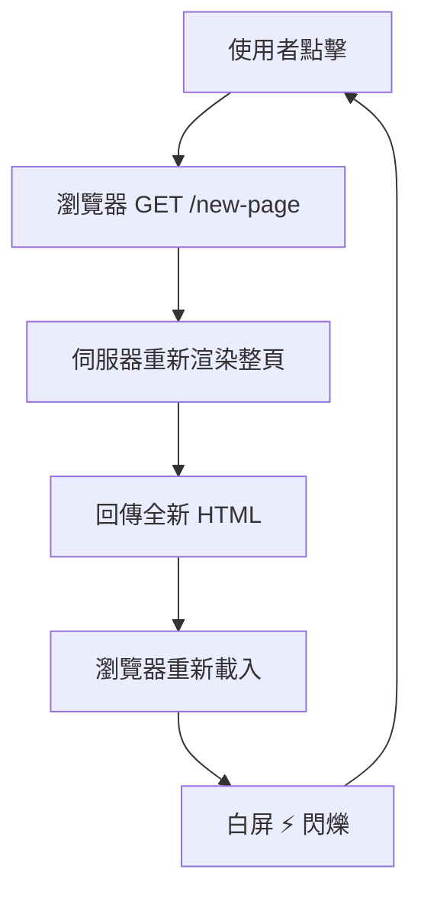
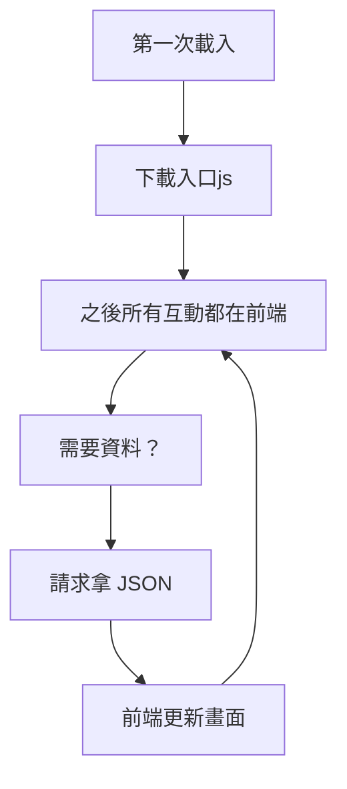
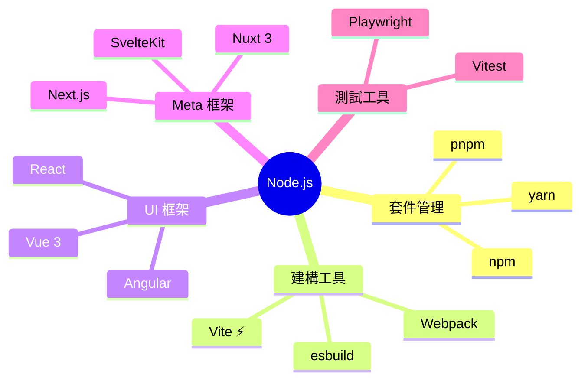

# 因為 Node.js 才讓這一切變的可能 ⚙️

  前端工程化革命：從腳本語言到完整生態系

<!--
說到這裡，前端遇到了跟後端一樣的問題：規模變大，需要工程化。
Node.js 的出現讓前端有了真正的開發工具鏈。
-->

---
level: 2
---

# 為什麼網頁要變成「應用程式」？

**傳統 MPA**

**現代 SPA**

- 使用者體驗更流暢：頁面切換不閃爍，像桌面應用程式
- 前後端分離：後端只負責 API，前端只負責呈現
- 你的 API 端點可以同時服務 Web、Mobile、Desktop

<!--
後端工程師聽到「前後端分離」通常都鬆一口氣。
意思是你只要管好 API 就好，前端的事情前端自己處理。
-->

---
level: 2
---

# <logos-nodejs class="inline text-green-400" /> 前端宇宙的誕生

3,700,000+

npm 套件數量（2025）

  ※ 連 <code>is-odd</code>（判斷是否為奇數）都是一個套件

  <carbon-checkmark-filled class="text-green-400 flex-shrink-0" />
  npm / pnpm — 套件管理

  <carbon-checkmark-filled class="text-green-400 flex-shrink-0" />
  Vite — 建構工具

  <carbon-checkmark-filled class="text-green-400 flex-shrink-0" />
  Vue / React / Angular — UI 框架

  <carbon-checkmark-filled class="text-green-400 flex-shrink-0" />
  Nuxt / Next.js — SSR Meta 框架

<!--
Node.js 讓 JavaScript 可以在伺服器端執行，
這開啟了整個前端工具鏈的可能性。

沒有 Node.js，就沒有 npm，就沒有 Vite，就沒有 Vue CLI，
前端就還在手動引入 script 標籤。
-->

---
level: 2
---

# 前端框架的漫長「進化」史 <carbon-time class="inline opacity-60" />

  說到框架，前端工程師最愛做的事就是每三年重寫一次...

<FrameworkTimeline />

不可否認的是，前端的管轄範圍已經從純使用者端進化涵蓋到了伺服器端甚至可以組件出自己的後端(BFF)

<!--
帶著大家點幾個節點，看看每個框架解決了什麼問題。

重點：Vue 出現是因為 Angular 太重、React 對後端來說太難。
Evan You 自己就是前端工程師，他知道什麼叫「學習友善」。

📌 每個節點可以簡單說：
  2010 Angular 1 → Google 帶來 MVC 概念，但太複雜
  2013 React → Facebook 帶來 Component，但 JSX 對後端很陌生
  2014 Vue → Evan You：「我就想要一個好上手的 React / Angular 替代品」
  2016 Angular 2 → Google 重寫了，打破向後相容，社群大暴走
  2016+ Next/Nuxt → SPA 的 SEO 問題逼出了 Meta Framework

📌 如果有人問「現在選哪個？」
  → 學習：Vue；工作有要求：配合公司；不知道：Vue 或 React 都行，概念通用。

📌 結尾金句：「每一個框架都是為了解決前一個的問題而生，但同時也帶來新的問題。」
-->

---
level: 2
layout: two-cols
layoutClass: gap-8
---

# 那為什麼選 Vue？

沒有最好的解方只有最適合的，並做出取捨

  
React Facebook, 2013

  

    
• 虛擬 DOM: 學習曲線偏陡峭，需深入理解運作機制

    
• 需要自己配 Router、狀態管理、測試框架...

    
• 社群生態豐富但分散，選擇太多反而困難

  

  

    捨棄：前端市場最廣 · Meta 超大規模實戰驗證 · 第三方生態最豐富
  

  
Angular Google, 2016

  

    
• 超重量級，像是前端版的 .NET MVC（不是壞事，但很胖）

    
• 大量 Decorator、DI、Module... 就是大卡車那種感覺

    
• 學習曲線更高更不直覺是三者中最陡峭的

  

  

    捨棄：最嚴謹的架構規範（大型團隊） · DI 讓測試最容易 · 企業規格最完整
  

::right::

  
Vue 3 ✨ Evan You, 2014

  

    

      ✅
      漸進式框架：可以慢慢導入，不用一次重寫
    

    

      ✅
      模板語法和 HTML 原生無縫接軌
    

    

      ✅
      官方提供 Vue Router + Pinia，不用自己決定，整合度高
    

    

      ✅
      中文文件，社群活躍
    

    

      ✅
      學習曲線最平緩，後端工程師轉換成本最低
    

  

  OK，進入正題
  <Arrow x1="10" y1="40" x2="400" y2="40" />

<!--
不是在說其他框架不好。
React 和 Angular 各有很強大的地方，很多大公司在用。

但對於後端工程師「入門前端」這個場景，Vue 是最友善的選擇。
特別是那個模板語法，等等你們看到就知道我在說什麼了。
-->
